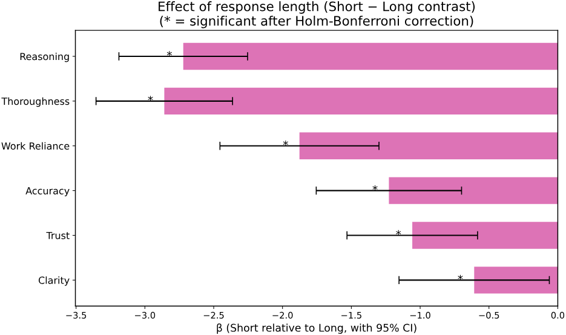
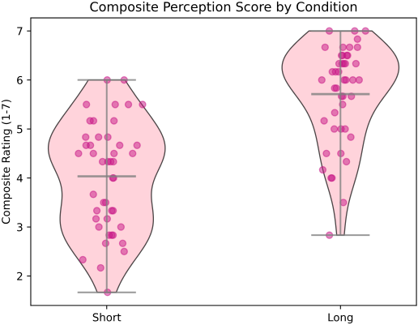

<p align="center">
<a href="https://git.io/typing-svg"></a>
</p>
<p align="center">
 2026
</p>


<table>
<tr>
<td width="70%" valign="top">

This repository contains the quantitative analysis behind *The Impact of Explanatory Depth (Operationalized Through Response Length) in Computing Professionals' Perceptions of AI-Generated Responses*, a course project for EECS 4461 (Hypermedia & Multimedia Technology) at York University. I'm a Biology and Computer Science student with an interest in Human-AI Interaction, and this project reflects the kind of work I want to keep doing: asking a precise empirical question about how people perceive AI systems, and answering it with methods that hold up to scrutiny.

The analysis lives in a single notebook, `main.ipynb`, which takes the study from raw survey exports to the statistics and figures reported in the paper. In the study, 10 computing professionals rated 18 AI-generated responses (3 prompts × 3 models × 2 length conditions) on six 7-point Likert dimensions: trust, accuracy, clarity, reasoning, work reliance, and thoroughness. To protect participants' privacy, the JSONL file containing the complete survey dataset has been omitted from the repository.

 
**The notebook is organized into three main stages:**
 
1. **Linear Mixed-Effects Modeling of Response Length Effects**  
   The core statistical analysis: does the length of an AI response change how computing professionals rate it? Each rating is modeled as `rating ~ length + order` in Python's `statsmodels`, with a random intercept per participant and a variance component per stimulus item, fitted via maximum likelihood. Maximal random-slope structures were attempted first and simplified when they failed to converge, following Matuschek et al. (2017). Significance comes from likelihood ratio tests against null models with Holm–Bonferroni sequential correction, and effect sizes are reported as Nakagawa marginal and conditional R² and Cohen's *d* (Westfall, Kenny, & Judd, 2014). Longer responses were rated significantly higher on all six dimensions, with the largest effects on thoroughness (*d* = −2.38) and reasoning (*d* = −2.32) and the smallest on clarity (*d* = −0.44).
2. **Descriptive Statistics and Figure Generation**  
   The distributional side of the story: internal consistency checks (Cronbach's α = 0.90), condition-level means, medians, and interquartile ranges, and publication figures including grouped bar charts with Morey-corrected within-subject error bars, per-participant spaghetti plots, a forest plot of the length coefficients, and a violin-and-strip plot of the composite score. What surprised me most here was the bimodal shape of the Short condition — some short responses held their own against long ones, while many others cratered, suggesting length acts less as a quality booster and more as a safeguard against poor ratings.
3. **Variance Decomposition and Model Diagnostics**  
   Validation of the modeling choices: variance partition coefficients from both null and full models following the LEVEL reporting checklist, plus residuals-vs-fitted, QQ, scale-location, and participant-influence plots for the composite score model. Stimulus items accounted for 41–47% of variance in the null models, confirming that a crossed random-effects structure (rather than repeated-measures ANOVA) was the right tool for these data. Methodological choices are grounded in Wiley & Rapp (2019) and Magezi (2015).

If you have any questions, or if you would like me to walk you through the analysis, feel free to reach out at [andreab5@my.yorku.ca](mailto:andreab5@my.yorku.ca).

With enthusiasm,

Andrea Barreto Luna

August 2026

---


</td>
<td width="30%" valign="top">

<!-- One thumbnail per stage, in the same order as the list on the left.
     Each image links to the notebook. Store files in a `resources/md/` folder.
     Screenshots of your best plot or figure from each stage work well here. -->

<a></a>
<a></a>

</td>
</tr>
</table>


#### Additionally, I have experience with:

<table><tr><td>
Within-Subjects & Mixed-Methods Design · Counterbalancing · Wizard-of-Oz Protocols · Survey & Instrument Design · Usability Testing · Heuristic Evaluation · Python (statsmodels, pandas, numpy, scipy, matplotlib) · R · Linear Mixed-Effects Models · Likelihood-Ratio Testing · Multiple-Comparison Correction · Effect-Size Estimation · Semi-Structured Interviewing · Inductive Thematic Analysis · Affinity Diagramming · Persona Development · Figma · LaTeX/Overleaf · Git · Spanish (native) · English (fluent)
</td></tr></table>


## To Run Locally

1. Clone the repo

```
git clone https://github.com/USERNAME/REPO-NAME.git
cd REPO-NAME
```

2. Create a virtual environment

Windows (PowerShell):
```
py -m venv .venv
.\.venv\Scripts\Activate.ps1
```

Windows (Command Prompt):
```
py -m venv .venv
.\.venv\Scripts\activate.bat
```

macOS / Linux:
```
python3 -m venv .venv
source .venv/bin/activate
```

After activation, you should see `(.venv)` at the beginning of each prompt.

3. Install dependencies

```
pip install --upgrade pip
pip install -r requirements.txt
```

4. Launch the notebook

```
jupyter lab
```

Then open `main.ipynb` from the file browser. Run the cells from top to bottom, as later cells depend on variables defined earlier.


This repository was created for educational and personal portfolio purposes. I **do not** consent to the use of my code for training language models, machine learning systems, or other AI tools.